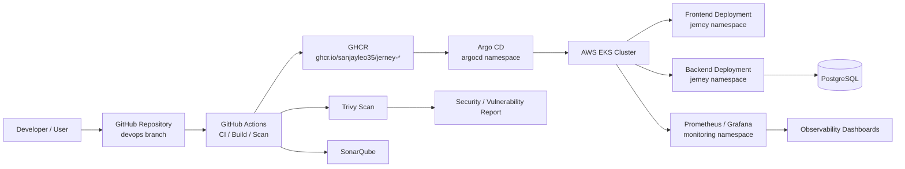

# Jerney


Jerney is a full-stack application built with a React frontend, Node.js backend, and PostgreSQL database. It is deployed on AWS EKS using DevSecOps practices across infrastructure provisioning, containerization, automated security scanning, and GitOps-driven delivery.

> Important: This project is intended to be operated from the `devops` branch. The CI/CD, GitOps, and image automation examples in this README assume the `devops` branch is the active deployment branch.

---

## 1. Project Overview

Jerney is a blogging and content platform that follows a modern cloud-native deployment model:

- Frontend: React application served through a lightweight web runtime
- Backend: Node.js API for application logic and data access
- Database: PostgreSQL for persistent application data
- Platform: AWS EKS for cluster orchestration and runtime deployment
- Delivery model: Argo CD GitOps for reconciliation from source control
- Security model: Trivy, SonarQube, and GitHub Actions-based validation before deployment

The end-to-end setup ensures that infrastructure, application containers, and runtime behavior are validated and monitored before production release.

---

## 2. Architecture & Tech Stack



### Infrastructure

- AWS EKS
- Amazon VPC and networking resources
- IAM policies and least-privilege access
- Terraform for reusable infrastructure provisioning

### Containerization & CI

- Docker for building application images
- GitHub Actions for automation and validation
- GitHub Container Registry (GHCR)
- Images are built and referenced in lowercase format such as:

```bash
ghcr.io/sanjayleo35/jerney-backend:latest
ghcr.io/sanjayleo35/jerney-frontend:latest
```

### Continuous Delivery (GitOps)

- Argo CD installed in the `argocd` namespace
- Application manifests stored in Git and synced from the `devops` branch
- Automated sync and self-healing enabled for application reconciliation

### Observability

- Prometheus and Grafana via `kube-prometheus-stack`
- Monitoring namespace used for telemetry and dashboards
- Kubernetes resource visibility for app health and cluster metrics

### Security

- Trivy for vulnerability and Kubernetes scanning
- SonarQube for code quality and static analysis
- Checkov for Infrastructure as Code (IaC) security scanning of Terraform configurations
- Automated security checks integrated into CI workflow and deployment gatekeeping

---

## 3. Phase-by-Phase Implementation Summary

### Phase 1: Infrastructure Provisioning with Terraform

Provision the AWS environment required to run the cluster and supporting resources:

```bash
cd terraform
terraform init
terraform plan
terraform apply --auto-approve
```

This phase includes the VPC, networking, IAM, and EKS cluster setup needed before deploying application workloads.

### Phase 2: Docker Build & GitHub Actions CI Pipeline

Build the container images and push them to GHCR using lowercase repository names:

```bash
docker build -t ghcr.io/sanjayleo35/jerney-backend:latest ./backend
docker build -t ghcr.io/sanjayleo35/jerney-frontend:latest ./frontend

docker login ghcr.io -u sanjayleo35

docker push ghcr.io/sanjayleo35/jerney-backend:latest
docker push ghcr.io/sanjayleo35/jerney-frontend:latest
```

GitHub Actions validates code quality, builds artifacts, and enforces security scans before release.

### Phase 3: Kubernetes Orchestration

The `k8s/` directory contains the namespace and deployment manifests for the app stack, including:

- Namespace declaration (`jerney`)
- StorageClass for EBS gp3 volumes (`jerney-ebs-sc`)
- Database secret template (`secret.yaml`) and example (`secret.example.yaml`)
- PostgreSQL database deployment and PersistentVolumeClaim
- Backend deployment and Service
- Frontend deployment and Service
- Network policies for least-privilege inter-pod communication

To deploy the Kubernetes manifests:

```bash
# 1. Create namespace and storage class
kubectl apply -f k8s/namespace.yaml
kubectl apply -f k8s/storageclass.yaml

# 2. Apply database secret (configure credentials before deploying)
kubectl apply -f k8s/secret.yaml

# 3. Apply workloads, services, and network policies
kubectl apply -f k8s/
```

### Phase 4: GitOps CD Setup with Argo CD

Argo CD watches the Git repository and reconciles the cluster to the desired state. The application manifest is targeted to the `argocd` namespace and synced from the `devops` branch.

```bash
# Create the Argo CD application in the argocd namespace
kubectl apply -f argocd-app.yaml

# Check status and force sync if needed
kubectl get application jerney-app -n argocd
kubectl patch app jerney-app -n argocd --type merge -p '{"metadata":{"annotations":{"argocd.argoproj.io/refresh":"hard"}}}'
```

This automation ensures changes pushed to Git are reflected in Kubernetes without manual imperative commands.

### Phase 5: Cloud Observability & Security Auditing

Monitoring and scanning are part of the DevSecOps lifecycle:

- Prometheus + Grafana provide runtime observability
- Trivy scans Kubernetes manifests and container images for vulnerabilities
- SonarQube analyzes code quality and maintainability
- Checkov scans Terraform IaC configurations for security compliance

```bash
# Trivy scan on Kubernetes namespace
trivy k8s --include-namespaces jerney --report summary

# Checkov scan on Terraform IaC
checkov -d terraform/
```

---

## 4. Local Development & Verification Commands

### Kubernetes checks

```bash
# Check application pods in jerney namespace
kubectl get pods -n jerney
kubectl get svc -n jerney
kubectl get deployment -n jerney

# Inspect Argo CD resources
kubectl get pods -n argocd
kubectl get application jerney-app -n argocd
kubectl get secret -n argocd

# Inspect monitoring resources
kubectl get pods -n monitoring
kubectl get svc -n monitoring
```

### Verify running image references

```bash
kubectl get deployment jerney-backend -n jerney -o jsonpath='{.spec.template.spec.containers[0].image}'
kubectl get deployment jerney-frontend -n jerney -o jsonpath='{.spec.template.spec.containers[0].image}'
```

Expected output style:

```bash
ghcr.io/sanjayleo35/jerney-backend:latest
ghcr.io/sanjayleo35/jerney-frontend:latest
```

### Trivy security scan

```bash
trivy k8s --include-namespaces jerney --report summary
```

### Port-forward for Grafana

```bash
kubectl port-forward --address 0.0.0.0 svc/kube-prometheus-stack-grafana -n monitoring 3000:80
```

Then open:

```text
http://localhost:3000
```

### Port-forward for Argo CD UI

```bash
kubectl port-forward --address 0.0.0.0 svc/argocd-server -n argocd 8080:443
```

Then open:

```text
https://localhost:8080
```

To retrieve the admin password:

```bash
kubectl -n argocd get secret argocd-initial-admin-secret -o jsonpath="{.data.password}" | base64 -d
```

---

## Summary

Jerney demonstrates a complete DevSecOps lifecycle in a Kubernetes environment: infrastructure provisioning with Terraform, secure containerization with GitHub Actions and GHCR, declarative deployment via Argo CD, and observability and security auditing with Prometheus, Grafana, and Trivy. The repository is structured for repeatability, automation, and production-ready deployment practices.
