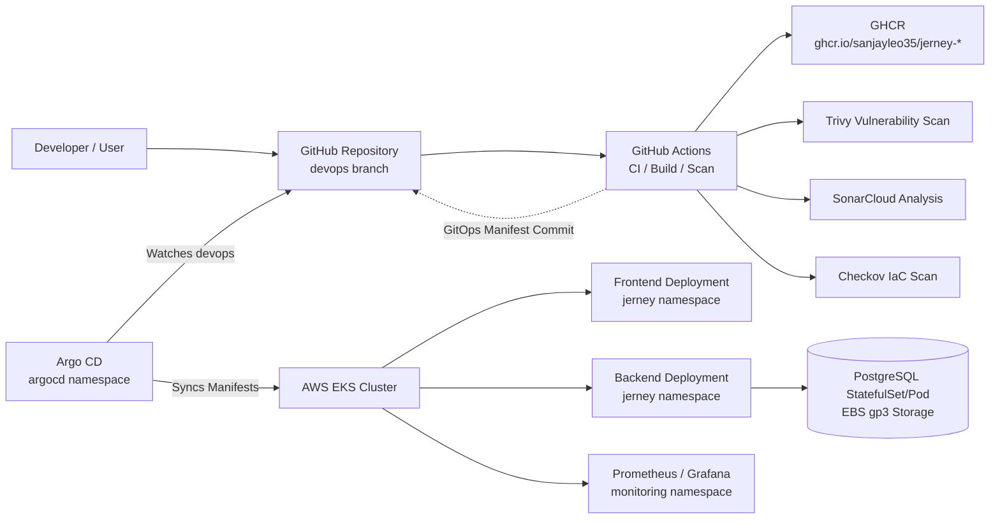

# Jerney


Jerney is a full-stack blogging and content platform built with a React frontend, Node.js API backend, and PostgreSQL database. It is deployed on AWS EKS using DevSecOps practices across infrastructure provisioning, containerization, automated security scanning, and GitOps-driven delivery.

> **Important**: This project is operated from the `devops` branch. All CI/CD triggers, GitOps synchronization, and deployment manifests assume `devops` is the active branch.

---

## 1. Architecture & Tech Stack



### Core Technologies

- **Frontend**: React (Vite, React Router, Axios) served via Nginx (non-root, listening on port 8080)
- **Backend**: Node.js Express REST API (`/api/posts`, `/api/comments`, `/api/health`) executed under `dumb-init` as non-root user (`appuser:1000`)
- **Database**: PostgreSQL 16 on Amazon EBS `gp3` storage with `WaitForFirstConsumer` volume binding
- **Infrastructure**: AWS EKS (Auto Mode) and VPC provisioned with Terraform
- **GitOps Delivery**: Argo CD watching `k8s/` manifests on the `devops` branch
- **Security & Quality**:
  - **Checkov**: Infrastructure as Code (IaC) security scanner for Terraform
  - **Trivy**: Container image vulnerability scanner (blocks CRITICAL unfixed CVEs)
  - **SonarCloud**: Static Application Security Testing (SAST) and code quality gate
  - **npm audit**: Dependency vulnerability scanning
  - **NetworkPolicies**: Restricts inter-pod communication (`frontend -> backend -> db`)

---

## 2. Repository Structure

```text
.
├── .checkov.yml                  # Checkov IaC scan policy configuration
├── .env.example                  # Environment variable reference
├── .github/
│   └── workflows/
│       └── devsecops.yml         # GitHub Actions DevSecOps CI/CD pipeline
├── .gitignore                    # Git ignore rules for state, secrets, dependencies
├── README.md                     # Project documentation
├── argocd-app.yaml               # Argo CD Application CRD manifest
├── backend/                      # Node.js API Service
│   ├── .dockerignore
│   ├── .eslintrc.json
│   ├── Dockerfile                # Multi-stage non-root Node.js Dockerfile
│   ├── package.json
│   └── src/                      # API controllers, models, and migrations
├── frontend/                     # React Single-Page Application
│   ├── .dockerignore
│   ├── .eslintrc.json
│   ├── Dockerfile                # Multi-stage non-root Nginx Dockerfile
│   ├── nginx.conf                # Custom Nginx reverse proxy & security headers
│   ├── package.json
│   └── src/                      # React UI components & views
├── k8s/                          # Kubernetes Manifests (GitOps source)
│   ├── namespace.yaml            # 'jerney' namespace
│   ├── storageclass.yaml         # EBS gp3 StorageClass ('jerney-ebs-sc')
│   ├── secret.yaml               # Secret template (development placeholder)
│   ├── secret.example.yaml       # Secret format and production guidance
│   ├── db-pvc.yaml               # PostgreSQL PersistentVolumeClaim (10Gi)
│   ├── db-deployment.yaml        # PostgreSQL Deployment (Recreate strategy)
│   ├── db-service.yaml           # Database ClusterIP Service (port 5432)
│   ├── backend-deployment.yaml   # Backend Deployment with db-migrate initContainer
│   ├── backend-service.yaml      # Backend ClusterIP Service (port 5000)
│   ├── frontend-deployment.yaml  # Frontend Deployment (port 8080)
│   ├── frontend-service.yaml     # Frontend NodePort Service (port 80 -> 8080)
│   └── network-policy.yaml       # Least-privilege ingress network policies
├── sonar-project.properties      # SonarCloud scanner configuration
└── terraform/                    # Terraform Infrastructure as Code
    ├── main.tf                   # VPC and EKS Auto Mode modules
    ├── outputs.tf                # Cluster endpoints, CA, and connection strings
    ├── provider.tf               # AWS provider and Terraform version constraints
    ├── terraform.tfvars          # Environment variable values (dev)
    └── variables.tf              # Input variable definitions & validation
```

---

## 3. Prerequisites

Before deploying, ensure you have the following tools installed and configured:

- **AWS CLI** (v2.x) configured with administrative credentials (`aws configure`)
- **Terraform** (>= 1.6.0)
- **kubectl** (v1.28+)
- **Docker** (v24+)
- **Node.js** (v20.x) & **npm**

---

## 4. Terraform & EKS Deployment (Phase 1)

The infrastructure is provisioned using official HashiCorp AWS modules with EKS Auto Mode and envelope KMS encryption for Kubernetes secrets at rest:

```bash
cd terraform

# 1. Initialize Terraform providers and modules
terraform init

# 2. Review execution plan
terraform plan

# 3. Apply infrastructure
terraform apply --auto-approve
```

### Configure kubectl

After Terraform completes, update your local `kubeconfig`:

```bash
aws eks update-kubeconfig --region us-east-1 --name jerney-eks
```

Verify cluster access:

```bash
kubectl get nodes
```

---

## 5. Kubernetes Secrets Configuration (Phase 2)

Secrets are never stored in plain text in version control. Safe templates (`secret.yaml` and `secret.example.yaml`) are provided in `k8s/`.

### Development Deployment

Before deploying workloads, apply the database secret to the cluster:

```bash
kubectl apply -f k8s/namespace.yaml
kubectl apply -f k8s/secret.yaml
```

> **Production Recommendation**: In production environments, use the **External Secrets Operator (ESO)** with AWS Secrets Manager or HashiCorp Vault to inject credentials dynamically into Kubernetes Secrets without storing values in Git.

---

## 6. CI/CD & DevSecOps Pipeline (Phase 3)

The GitHub Actions workflow (`.github/workflows/devsecops.yml`) executes an automated DevSecOps cycle on every push to the `devops` branch:

1. **Static Analysis & Linting**: ESLint checks on backend and frontend code.
2. **Dependency Audit**: `npm audit --audit-level=critical` scans for severe vulnerabilities.
3. **SonarCloud Scan**: SAST scan for code quality, security hotspots, and bugs.
4. **Checkov IaC Scan**: Terraform security compliance analysis.
5. **Container Build**: Multi-stage Docker builds tagged with `${GITHUB_SHA}`.
6. **Trivy Image Scan**: Vulnerability scan failing on CRITICAL unfixed CVEs.
7. **GHCR Registry Push**: Images pushed with immutable commit SHA tags:
   - `ghcr.io/sanjayleo35/jerney-backend:<commit-sha>`
   - `ghcr.io/sanjayleo35/jerney-frontend:<commit-sha>`
8. **GitOps Manifest Update**: Automated update of `k8s/backend-deployment.yaml` and `k8s/frontend-deployment.yaml` with the new commit SHA.
9. **GitOps Auto-Commit**: Pushes updated manifests with `[skip ci]` to `devops`.

### Breaking the GitOps Loop

To prevent automated GitOps manifest commits from triggering infinite recursive CI builds:
- The workflow includes `paths-ignore:` for `'k8s/**'`, `'README.md'`, and `'.checkov.yml'`.
- The commit message includes `[skip ci]`.
- The auto-commit action strictly restricts its commit diff to `file_pattern: k8s/backend-deployment.yaml k8s/frontend-deployment.yaml`.

---

## 7. Kubernetes Workload Deployment (Phase 4)

Deploy all Kubernetes manifests in order:

```bash
# 1. Apply Namespace and StorageClass
kubectl apply -f k8s/namespace.yaml
kubectl apply -f k8s/storageclass.yaml

# 2. Apply Database Secret
kubectl apply -f k8s/secret.yaml

# 3. Apply all workloads and network policies
kubectl apply -f k8s/
```

### Workload Architecture

- **PostgreSQL**: Single replica with `strategy: Recreate` ensuring safe EBS RWO volume unmount/remount during pod restarts.
- **Backend**: 2 replicas with `initContainers`:
  - `wait-for-db`: Polls PostgreSQL port 5432 using `busybox:1.36` until database is ready.
  - `db-migrate`: Runs database schema migrations (`node src/migrate.js`) before API server starts.
- **Frontend**: 2 replicas running Nginx as non-root on port 8080 with API reverse-proxy routing to `jerney-backend:5000`.
- **NetworkPolicy**: Isolates database ingress exclusively to `jerney-backend` pods, and backend ingress exclusively to `jerney-frontend` pods.

---

## 8. Argo CD & GitOps Continuous Delivery (Phase 5)

Argo CD manages declarative reconciliation between the Git repository and the EKS cluster:

```bash
# 1. Install Argo CD (if not already installed)
kubectl create namespace argocd
kubectl apply -n argocd -f https://raw.githubusercontent.com/argoproj/argo-cd/stable/manifests/install.yaml

# 2. Apply the Jerney Argo CD Application
kubectl apply -f argocd-app.yaml

# 3. Verify sync status
kubectl get application jerney-app -n argocd
```

### Retrieve Argo CD Admin Password

```bash
kubectl -n argocd get secret argocd-initial-admin-secret -o jsonpath="{.data.password}" | base64 -d && echo
```

### Access Argo CD Web UI

```bash
kubectl port-forward --address 0.0.0.0 svc/argocd-server -n argocd 8080:443
```
Open `https://localhost:8080` (Username: `admin`).

---

## 9. Verification & Observability

### Verify Pods and Services

```bash
# Check all resources in the jerney namespace
kubectl get pods,svc,pvc -n jerney -o wide
```

### Verify Running Image References

Ensure pods run immutable SHA-tagged images:

```bash
kubectl get deployment jerney-backend -n jerney -o jsonpath='{.spec.template.spec.containers[0].image}'
echo ""
kubectl get deployment jerney-frontend -n jerney -o jsonpath='{.spec.template.spec.containers[0].image}'
echo ""
```

Expected output format:
```bash
ghcr.io/sanjayleo35/jerney-backend:<commit-sha>
ghcr.io/sanjayleo35/jerney-frontend:<commit-sha>
```

### Access Frontend Application

For local testing and portfolio validation, port-forward the frontend service:

```bash
kubectl port-forward --address 0.0.0.0 svc/jerney-frontend -n jerney 3000:80
```
Open `http://localhost:3000`.

### Access Prometheus & Grafana Monitoring

```bash
kubectl port-forward --address 0.0.0.0 svc/kube-prometheus-stack-grafana -n monitoring 3001:80
```
Open `http://localhost:3001` (Default login: `admin` / `prom-operator`).

---

## 10. Local Docker Compose Workflow

To run the full stack locally for development without Kubernetes:

```bash
# Start all services (PostgreSQL, db-migrate, backend, frontend)
docker compose up --build

# Stop all services and clean up volumes
docker compose down -v
```

---

## 11. Security Scanning Commands

Run local security scans before pushing code:

```bash
# Checkov IaC scan on Terraform
checkov -d terraform/ --config-file .checkov.yml

# Trivy image vulnerability scan
trivy image --severity CRITICAL --ignore-unfixed ghcr.io/sanjayleo35/jerney-backend:<commit-sha>
trivy image --severity CRITICAL --ignore-unfixed ghcr.io/sanjayleo35/jerney-frontend:<commit-sha>

# Trivy Kubernetes security scan
trivy k8s --include-namespaces jerney --report summary
```

---

## 12. Troubleshooting Guide

| Issue | Root Cause | Solution |
| :--- | :--- | :--- |
| `Pod Pending` on `jerney-db` | EBS Volume binding waiting for node or EBS CSI driver | Verify EBS CSI driver is active and StorageClass volumeBindingMode is `WaitForFirstConsumer`. |
| `db-migrate` initContainer failing | PostgreSQL not yet accepting connections or wrong credentials | Check `jerney-db-secret` credentials; verify `wait-for-db` initContainer completed successfully. |
| `404 Not Found` on API routes | Nginx proxy configuration mismatch | Ensure `frontend/nginx.conf` proxies `/api/` to `http://jerney-backend:5000`. |
| `NetworkPolicy` dropping traffic | Pod labels do not match selector | Check `app.kubernetes.io/name` labels on backend and frontend deployments. |
| Argo CD `OutOfSync` | Git branch or manifest tag updated in repository | Click **Sync** in Argo CD UI or run `kubectl patch app jerney-app -n argocd --type merge -p '{"metadata":{"annotations":{"argocd.argoproj.io/refresh":"hard"}}}'`. |

---

## 13. Teardown & Resource Cleanup

To clean up all AWS resources and avoid unnecessary charges:

```bash
# 1. Delete Kubernetes workloads and Argo CD application
kubectl delete -f argocd-app.yaml --ignore-not-found
kubectl delete -f k8s/ --ignore-not-found

# 2. Destroy Terraform infrastructure
cd terraform
terraform destroy --auto-approve
```

---

## 14. Production Readiness & Enterprise Recommendations

For enterprise production deployments, the following architectural enhancements are recommended:

1. **Managed Database (Amazon RDS / Aurora PostgreSQL)**: Replace in-cluster containerized PostgreSQL with Multi-AZ Amazon RDS for automated backups, read replicas, automatic failover, and point-in-time recovery.
2. **AWS Load Balancer Controller (ALB / Ingress)**: Deploy AWS Load Balancer Controller with an Ingress resource and AWS Certificate Manager (ACM) for HTTPS/TLS termination instead of NodePort.
3. **External Secrets Operator**: Integrate ESO with AWS Secrets Manager for secret rotation and zero-secret GitOps.
4. **IRSA (IAM Roles for Service Accounts)**: Assign fine-grained IAM roles directly to Kubernetes service accounts instead of node-level credentials.
5. **Horizontal Pod Autoscaler (HPA)**: Configure HPA based on CPU/Memory and custom Prometheus metrics for auto-scaling under load.
